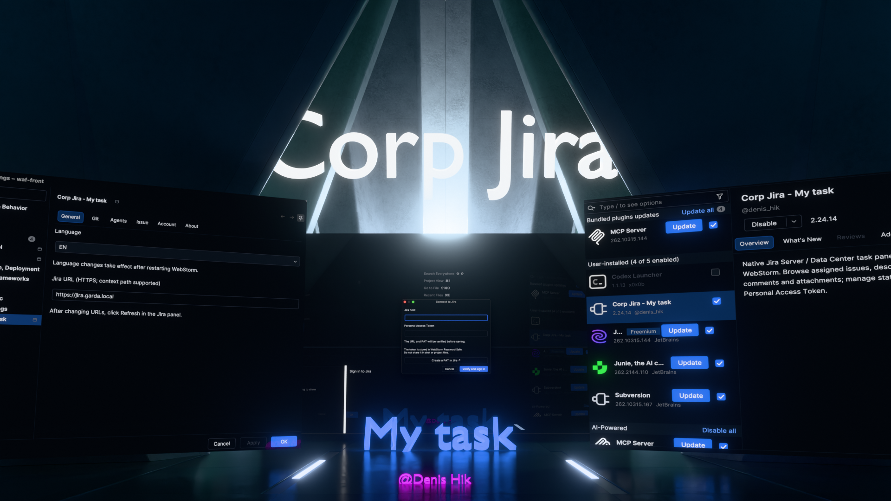

# Corp Jira - My task

[English](README.md) | **Русский**

Нативный плагин WebStorm для корпоративной Jira Server / Data Center.

## Превью

<a href="docs/images/CorpJiraPreview.png"></a>

## Возможности

- Задачи по JQL, переключаемые фильтры и хранилище именованных запросов.
- Карточка задачи, смена статуса и исполнителя.
- Медиа, комментарии, вложения и упоминания пользователей.
- Ссылки на коммиты в Git Log и подготовка черновика в AI Assistant.
- Вход по PAT, профиль аккаунта, сохранение согласия на конкретный TLS-сертификат.

- Язык интерфейса EN / RU: по умолчанию язык IDE, выбор в основных настройках; после смены нужен перезапуск IDE.
- Именованные ссылки Jira в описании открываются по нажатию.

## Установка

Скачайте ZIP из [последнего релиза](https://github.com/denis-hik/corp-jira-my-task-public/releases/latest). В WebStorm откройте Settings → Plugins → меню шестерёнки → Install Plugin from Disk и выберите ZIP. Перезапустите IDE, если она предложит это.

Поддерживаемые версии WebStorm: 2025.3, 2026.1 и 2026.2 (сборки 253–262.*). Задайте адрес Jira и PAT в окне входа. Секрет хранится через Password Safe IDE, в репозитории токенов нет.

## Сборка

Требуются Python 3 и установленный WebStorm с JBR javac и SDK-библиотеками. По умолчанию используется `/Applications/WebStorm.app/Contents`; для другого пути задайте `WEBSTORM_HOME`. Для релизов с поддержкой 2025.3 используйте SDK WebStorm 2025.3 и проверяйте готовый ZIP на всех заявленных ветках через JetBrains Plugin Verifier.

```sh
python3 build.py
```

Архив появится в `dist/`. Сборка обфусцирует внутренние классы и приватные члены через ASM из SDK WebStorm. Исходники, debug metadata и таблица соответствий не входят в ZIP. Таблицу `build/obfuscation-map.tsv` сохраняйте отдельно для соответствующего релиза; она не предназначена для распространения.

Публичная версия использует ID `local.corp.jira.myTasks`. При переходе с прежней приватной сборки отключите её и заново настройте подключение в публичной версии.

## Ограничения

Поддерживается Jira Server / Data Center с PAT; совместимость с Jira Cloud не заявлена. Многошаговые маршруты основаны на встроенной схеме статусов и могут не соответствовать workflow вашего сервера. Для новых установок выбран Standard: только переходы, возвращённые Jira для текущей задачи.

Интеграция AI использует внутренние API JetBrains. 

## Лицензия и правила

[MIT](LICENSE): разрешены использование, изменение и распространение с сохранением уведомления об авторстве.

- [Конфиденциальность](PRIVACY.md)
- [Безопасность](SECURITY.md)
- [Обратная связь и вклад в проект](CONTRIBUTING.md)
- [Подготовка публичной публикации](PUBLICATION.md)

Плагин не связан с Atlassian или JetBrains и не является их официальным продуктом.
